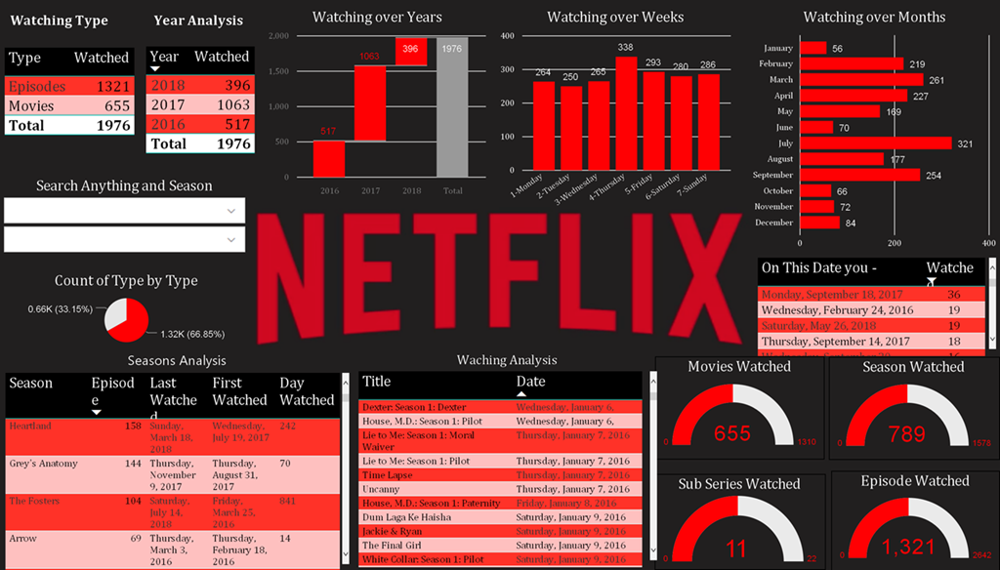

# final_project
Data science final project done by Carla, lea, Livia and Natalia
# Analysing Netflix insights

###Data science for economists final project
####Professor: Bogdan-Alexandru Ratiu
####Students: Natalia Boggiano, Livia Ceribelli, Lea Hanna and Carla Llorente

## Project explanation
In this project we wanted to get some Netflix insights of how the streaming platform works, how much it charges per month in the different countries and compare its stock price with other streaming platforms.

The project contains 6 different files that explains:

1) The correlation between the Netflix price and GDP in different countries.
2) Analysis of the best Netflix shows.
3) Sentiment analysis of different tweets published that contains the word Netflix.
4) Comparison of Twitter likes between Netflix and its rivals.
5) Analysis of the Netflix, Disney and Amazon stock prices.
6) Knowing better our favourite TV Show - How I met your mother

###Hope you enjoy it!
